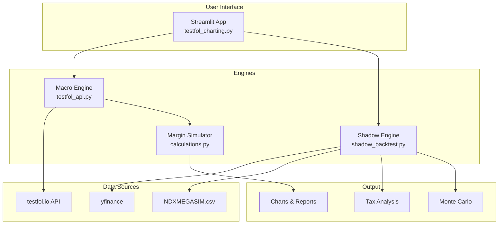

# Testfol Margin Stresser

A powerful Streamlit-based GUI application for backtesting portfolio strategies with high-fidelity margin trading and tax simulation.

## Overview

This tool allows you to simulate leveraged portfolio performance over historical periods (1885–Present), tracking margin debt, equity levels, and tax liabilities with extreme precision. Unlike simple CAGR calculators, this project simulates the **daily mechanical interactions** between portfolio volatility, margin interest, monthly withdrawals, and the tax code.

**Powered by [testfol.io](https://testfol.io)** - The application uses the Testfol API for high-quality historical total return data and uses a local "Shadow Engine" for advanced tax accounting.

## Documentation Navigation
For specific guides, please refer to the detailed documentation:
- **[User Guide](docs/user_guide.md)**: Configuration, parameters, and how to run your first simulation.
- **[Methodology](docs/methodology.md)**: Deep dive into the math behind the margin, tax, and CAGR calculations.
- **[FAQ & Troubleshooting](docs/faq.md)**: Explanations for date limits (e.g., 2002 inception), error messages, and limitations.

---

## Architecture

The application operates using a **Hybrid Engine** approach:



### Engine Responsibilities

| Engine | Location | Purpose |
|--------|----------|---------|
| **Macro Engine** | `app/services/testfol_api.py` | Fetches total return series from testfol.io. Acts as "Market Truth" source. |
| **Shadow Engine** | `app/core/shadow_backtest.py` | Reconstructs portfolio trade-by-trade. Tracks every tax lot (date, cost basis, quantity). Calculates ST vs LT gains. |
| **Margin Simulator** | `testfol_charting.py` | Applies margin loan model. Calculates daily interest, equity %, margin call risk. |


## The Shadow Backtest Engine

The core differentiation of this project is its ability to simulate taxes accurately using a **FIFO (First-In, First-Out) Tax Lot System**.

### 1. Tax Lot Tracking
Every purchase (initial allocation, rebalancing buy, or dividend reinvestment) creates a unique `TaxLot` object containing:
-   **Date Acquired**: Crucial for distinguishing Short-Term (<1yr) vs Long-Term (>1yr) gains.
-   **Cost Basis**: The original purchase price.
-   **Quantity**: Number of shares.

### 2. Proportional Cost Basis Recovery
When you sell a portion of a position (e.g., to rebalance or pay taxes), the engine sells shares from the oldest lot first (FIFO). Crucially, it calculates the cost basis for *only* the sold fraction, returning principal tax-free.

**Logic:**
```python
# From shadow_backtest.py
fraction = shares_to_sell / lot.quantity
cost_basis_sold = lot.total_cost_basis * fraction
realized_gain = proceeds - cost_basis_sold
```
*Example: You bought $100k of SPY. It grows to $150k. You sell $30k.*
-   You sold 20% of your position ($30k / $150k).
-   The engine uses 20% of your Cost Basis ($20k).
-   **Taxable Gain = $30k (Proceeds) - $20k (Basis) = $10k.**

### 3. Tax Treatment Detection
The engine automatically detects special asset classes based on tickers:
-   **Equity (Standard)**: 0%/15%/20% preferential rates (LT) vs Ordinary (ST).
-   **Section 1256 (e.g., DBMF, VIX)**: 60% Long-Term / 40% Short-Term split regardless of holding period.
-   **Collectibles (e.g., GLD, SLV)**: Taxed at ordinary rates but capped at 28% for Long-Term.

---

## Tax Logic & Methodology

This project includes a sophisticated `tax_library.py` that reconstructs US Tax Code history.

### Method 1: Historical Smart Calculation (Default)
This is the most accurate simulation of historical reality. It accounts for two major historical regimes:

1.  **Deduction/Exclusion Era (Pre-1987)**
    -   Historically, you didn't get a "lower rate." specific to gains. Instead, you were allowed to **exclude** 50% or 60% of your gain from income, and the rest was taxed at ordinary rates.
    -   *Example (1970)*: $100k Gain. Exclude 50%. Taxable Income = $50k @ Ordinary Rate (e.g., 70%). Eff Tax = 35%.
    -   **Alternative Tax Cap**: The code also checks the historical "Alternative Tax" (usually 25%), which acted as a hard cap on capital gains tax. You pay the lesser of the two.

2.  **Modern Bracket Era (1987–Present)**
    -   Switches to the current system of Preferential Brackets (0%, 15%, 20%).
    -   Includes **Net Investment Income Tax (NIIT)** of 3.8% for high earners (post-2013).

### Method 2: Historical Max Rate
Simplified method. Simply looks up the maximum marginal capital gains tax rate for that specific year (e.g., 20% in 2010, 28% in 1990) and applies it to all Long-Term gains.

### Method 3: 2025 Fixed
Anachronistic baseline. Applies today's tax rules (0%/15%/20% brackets) to all historical years. Useful for comparing "What if I held this portfolio today?" scenarios.

---

## Margin Simulation

The Margin Stresser simulates a loan account distinct from the portfolio value.

**The Equation:**
$$ Loan_{t} = Loan_{t-1} \times (1 + \frac{Rate_{annual}}{365}) + Draws + Taxes - Dividends $$

-   **Interest**: Compounded daily.
-   **Taxes**: Can be paid via **Margin Loan** (increasing debt) or **Asset Sales** (reducing compounding).
-   **Maintenance**: Checks daily if `Equity % < Maintenance Requirement`.

---

## Volatility Harvesting: Unlocking "Shannon's Demon"

This backtester is uniquely architected to simulate **Volatility Harvesting** strategies (often referred to as **Shannon's Demon** or Shannon's Ratchet).

### What is Shannon's Demon?
Claude Shannon demonstrated that by frequently rebalancing a portfolio between a volatile zero-return asset (like a coin toss) and a stable asset (Cash), you can generate **positive geometric growth** from volatility alone. This is the mathematical opposite of "Volatility Decay."

In modern investing, this is applied by mixing **Volatile Leveraged Assets** (e.g., TQQQ, bitcoin) with uncorrelated assets (e.g., Cash, TMF, KMLM) and rebalancing frequently.

### Why this Backtester?
Most backtesters fail to model this correctly because they ignore the **Execution Drag** which kills the demon in real life. Testfol Margin Stresser accounts for:
1.  **High-Frequency Rebalancing**: Simulate the granular effects of Daily vs. Weekly vs. Quarterly rebalancing to find the optimal frequency.
2.  **Tax Drag**: Rebalancing triggers capital gains. Our **Shadow Engine** calculates the exact tax bill for every rebalance, showing you if the "Harvested Volatility" exceeds the "Tax Drag" (a critical failure point for "Demon" strategies in taxable accounts).
3.  **Leverage Management**: Safely model "Cash + 3x Leveraged ETF" portfolios to verify if the cash buffer prevents margin calls during 90% drawdowns.

---

## Monte Carlo & Risk Analysis

The tool now includes a professional **Monte Carlo Simulation** suite to stress-test your strategy against thousands of alternative history timelines.

### Features
-   **Historical Bootstrap**: Unlike Gaussian simulations which assume normal distributions, we resample **actual historical daily returns** from your strategy. This preserves the "Fat Tails" and extreme market shocks (like 1987 or 2008) inherent to your specific asset allocation.
-   **Cone of Uncertainty**: Visualize the P10 (Pessimistic), Median, and P90 (Optimistic) future paths over 10 years.
-   **Distribution Analysis**: A robust histogram showing the probability distribution of final portfolio values, featuring:
    -   **Log/Linear Switching**: Automatically adapts binning to visualize massive upside outliers common in leveraged portfolios.
    -   **Smart Formatting**: Tooltips and axes use "B" (Billions) notation for readability.
-   **Sequence Risk**: Test how your portfolio survives purely based on the *order* of returns, specifically crucial for retirement (decumulation) mechanics.

---

## Installation & Usage

1.  **Install**:
    ```bash
    pip install -r requirements.txt
    ```
2.  **Run**:
    ```bash
    streamlit run testfol_charting.py
    ```

## Disclaimer
**Educational Use Only.** This software simulates tax and margin mechanics for research. It is not a substitute for profound professional financial or tax advice.
