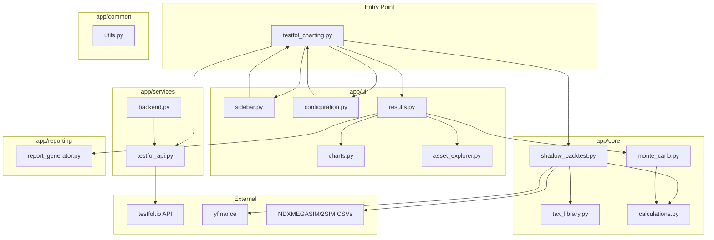
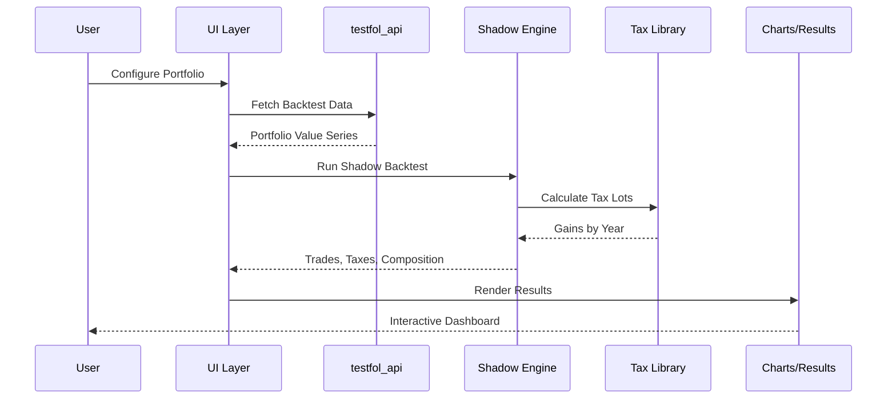
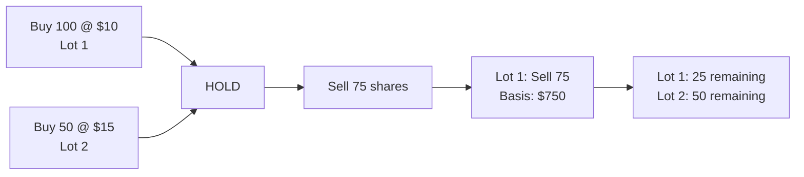

# App Architecture Reference

## Overview

The `app/` directory contains the modular Streamlit application for portfolio backtesting with margin simulation and tax analysis. It follows a clean separation of concerns across 5 submodules.

---

## Architecture Diagram

---

## Data Flow

---

## Module Reference

### `app/core/` - Business Logic

| File | Purpose | Key Functions |
|------|---------|---------------|
| `shadow_backtest.py` | FIFO tax lot tracking, rebalancing simulation | `run_shadow_backtest()` |
| `tax_library.py` | Historical US tax rates (1913-2025), gain calculations | `calculate_gains()`, `get_tax_rate()` |
| `monte_carlo.py` | Bootstrap simulation for risk analysis | `run_simulation()`, `plot_cone()` |
| `calculations.py` | Statistics, returns, Sharpe ratios | `generate_stats()`, `calculate_drawdown()` |

### `app/ui/` - User Interface

| File | Purpose | Key Functions |
|------|---------|---------------|
| `sidebar.py` | Date range picker, run button | `render_sidebar()` |
| `configuration.py` | Portfolio config, margin params, benchmarks | `render_config()` |
| `results.py` | Main results orchestration, tabs | `render_results()` |
| `charts.py` | All chart generation (Plotly) | `plot_portfolio()`, `plot_composition()`, `plot_sankey()` |
| `asset_explorer.py` | Deep-dive analysis for individual assets | `render_asset_explorer()` |

### `app/services/` - External Communication

| File | Purpose | Key Functions |
|------|---------|---------------|
| `testfol_api.py` | API wrapper & Margin Logic | `fetch_backtest()`, `simulate_margin()` |
| `data_service.py` | Complex data sourcing (FRED, splicing) | `get_fed_funds_rate()`, `get_ticker_data()` |
| `backend.py` | Legacy price utilities | `get_component_prices()` |

### `app/common/` - Utilities

| File | Purpose | Key Functions |
|------|---------|---------------|
| `utils.py` | Documentation rendering, formatting | `render_documentation()` |

### `app/reporting/` - Export

| File | Purpose | Key Functions |
|------|---------|---------------|
| `report_generator.py` | HTML report generation | `generate_html_report()` |

---

## Key Concepts

### Hybrid Engine Mode

The app operates in two modes:

1. **Standard Mode**: Pure testfol.io API
   - Uses remote API for all price data
   - Best for standard tickers (SPY, QQQ, etc.)

2. **Hybrid Mode** (auto-enabled for NDXMEGASIM/2SIM):
   - Loads local CSV for simulated indices
   - Splices with QBIG ETF for recent data
   - Uses local Shadow Engine for tax calculations

### Tax Lot System (FIFO)

### Chart Types

| Chart | Location | Description |
|-------|----------|-------------|
| Portfolio Performance | `charts.py` | Main value chart with margin overlay |
| Composition Stacked | `charts.py` | Asset allocation over time |
| Monthly Returns Heatmap | `charts.py` | Calendar heatmap of returns |
| Sankey Diagram | `charts.py` | Rebalancing flows visualization |
| Monte Carlo Cone | `monte_carlo.py` | Future probability distribution |

---

## File Sizes

| File | Size | Complexity |
|------|------|------------|
| `charts.py` | 80KB | High - All visualization logic |
| `results.py` | 58KB | High - Main orchestration |
| `shadow_backtest.py` | 37KB | High - Tax lot engine |
| `tax_library.py` | 32KB | Medium - Tax rate tables |
| `configuration.py` | 16KB | Medium - UI forms |
| `asset_explorer.py` | 13KB | Medium - Asset drill-down |
| `monte_carlo.py` | 12KB | Medium - Simulation |
| `report_generator.py` | 9KB | Low - HTML export |
| `calculations.py` | 8KB | Low - Math utilities |
| `testfol_api.py` | 8KB | Low - API wrapper |
| `backend.py` | 8KB | Low - Data utilities |
| `sidebar.py` | 4KB | Low - Simple UI |
| `utils.py` | 3KB | Low - Helpers |
