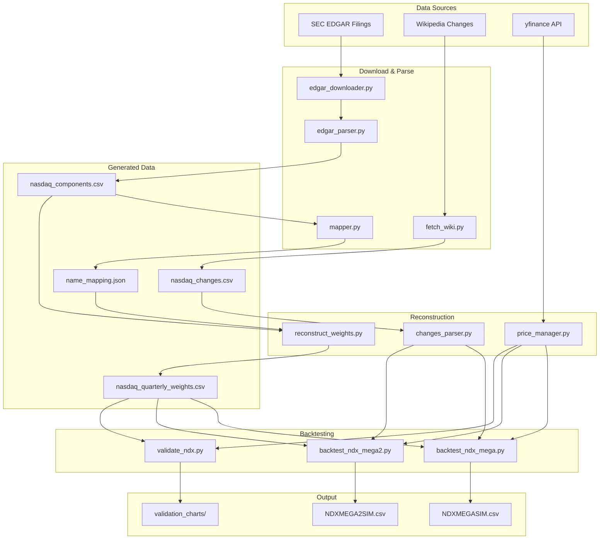
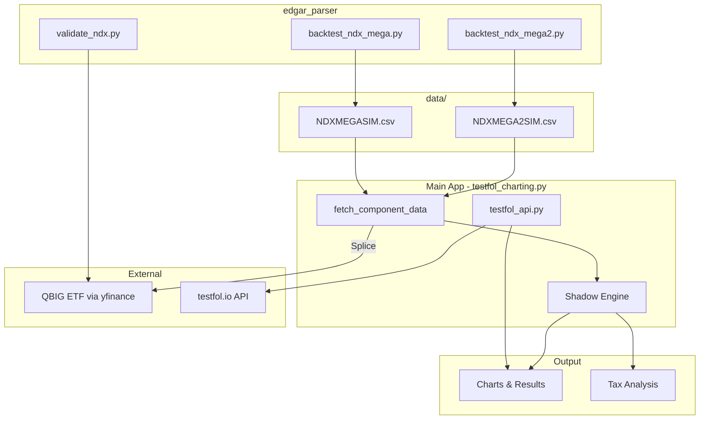

# EDGAR Parser - File Reference Guide

## Overview

This directory contains the NDX (Nasdaq-100) reconstruction and simulation system. It parses SEC EDGAR filings to extract historical index compositions, then backtests concentration strategies (NDX Mega 1.0 and 2.0).

---

## File Relationships



---

## Core Scripts

### Data Acquisition

| File | Purpose | Input | Output |
|------|---------|-------|--------|
| `edgar_downloader.py` | Downloads 485BPOS filings from SEC EDGAR | SEC API | `downloads/*.html` |
| `edgar_parser.py` | Parses HTML filings to extract holdings tables | `downloads/*.html` | `nasdaq_components.csv` |
| `mapper.py` | Maps company names to tickers using SEC data | `nasdaq_components.csv` | `name_mapping.json` |
| `fetch_wiki.py` | Scrapes Wikipedia for historical NDX changes | Wikipedia | `nasdaq_changes.csv` |

### Data Processing

| File | Purpose | Input | Output |
|------|---------|-------|--------|
| `reconstruct_weights.py` | Reconstructs quarterly weights with NDX capping rules | `nasdaq_components.csv`, `name_mapping.json` | `nasdaq_quarterly_weights.csv` |
| `price_manager.py` | Centralized yfinance data fetching with pickle cache | yfinance API | `prices_cache.pkl` |
| `changes_parser.py` | Parses mid-quarter additions/removals for replacement logic | `nasdaq_changes.csv` | In-memory dict |

### Simulation & Validation

| File | Purpose | Input | Output |
|------|---------|-------|--------|
| `backtest_ndx_mega.py` | Simulates NDX Mega 1.0 strategy (47% threshold, 35% cap) | `nasdaq_quarterly_weights.csv` | `../NDXMEGASIM.csv` |
| `backtest_ndx_mega2.py` | Simulates NDX Mega 2.0 strategy (40% threshold, 30% cap, min 9 stocks) | `nasdaq_quarterly_weights.csv` | `../NDXMEGA2SIM.csv` |
| `validate_ndx.py` | Validates reconstruction against QQQ benchmark + compares with QBIG ETF | All data | `validation_charts/*.png` |

### Utilities

| File | Purpose |
|------|---------|
| `config.py` | Centralized constants (thresholds, caps, file paths) |
| `chart_style.py` | Publication-quality chart formatting |
| `check_yf.py` | Debug utility for checking yfinance data availability |
| `testfol_api.py` | API wrapper for testfol.io backtesting service |
| `holdings_viewer.py` | Streamlit app to explore constituent history |

---

## Data Files

| File | Description | Size |
|------|-------------|------|
| `nasdaq_components.csv` | Raw parsed holdings from EDGAR filings (Company, Shares, Value, Date) | 270KB |
| `name_mapping.json` | Company name → Ticker mapping (e.g., "APPLE COMPUTER INC" → "AAPL") | 11KB |
| `nasdaq_changes.csv` | Historical index additions/removals (2012-2025 from Wikipedia) | 24KB |
| `nasdaq_quarterly_weights.csv` | Reconstructed quarterly weights with NDX capping rules applied | 899KB |
| `company_tickers.json` | SEC CIK → Ticker master list (downloaded from SEC) | 802KB |
| `prices_cache.pkl` | Cached yfinance price data (pickle format) | ~15MB |

---

## Directories

| Directory | Contents |
|-----------|----------|
| `downloads/` | Raw SEC EDGAR filing HTML files |
| `output/` | Constituent history CSVs (`ndx_mega_constituents.csv`, `ndx_mega2_constituents.csv`) |
| `validation_charts/` | Generated comparison charts (PNG) |
| `docs/` | Methodology PDFs and documentation |

---

## Execution Order

To rebuild everything from scratch:

```bash
# 1. Download EDGAR filings (if not already present)
python edgar_downloader.py

# 2. Parse filings to extract holdings
python edgar_parser.py

# 3. Map company names to tickers
python mapper.py

# 4. Reconstruct quarterly weights with NDX rules
python reconstruct_weights.py

# 5. Run backtests
python backtest_ndx_mega.py    # Mega 1.0
python backtest_ndx_mega2.py   # Mega 2.0

# 6. Validate against benchmarks
python validate_ndx.py

# 7. (Optional) View holdings interactively
python holdings_viewer.py
```

---

## Configuration Reference

From `config.py`:

```python
# NDX Mega 1.0 Constants
MEGA1_TARGET_THRESHOLD = 0.47   # Top 47% cumulative weight
MEGA1_BUFFER_THRESHOLD = 0.50   # Buffer zone for quarterly rebal
MEGA1_SINGLE_STOCK_CAP = 0.35   # Max 35% per stock

# NDX Mega 2.0 Constants
MEGA2_TARGET_THRESHOLD = 0.47   # Top 47% cumulative weight
MEGA2_BUFFER_THRESHOLD = 0.50   # Buffer zone for quarterly rebal
MEGA2_SINGLE_STOCK_CAP = 0.30   # Max 30% per stock
MEGA2_MIN_CONSTITUENTS = 9      # Minimum security rule

# Capping Algorithm
MAX_CAP_ITERATIONS = 20         # Convergence limit
```

---

## Key Methodology Notes

1. **Fitted vs Predictive Models**:
   - Standard Reconstruction (`validate_ndx.py`) = Fitted model (forces zero tracking error)
   - Mega 1.0 & 2.0 = Predictive forward-looking backtests

2. **Minimum Security Rule (Mega 2.0)**:
   - When triggered, standards get capped weight, fillers absorb remainder
   - Ensures 100% investment (matches real QBIG ETF behavior)

3. **QBIG Validation**:
   - QBIG ETF tracks Mega 2.0 index
   - Our simulation achieves 0.9932 correlation, 5.32% tracking error, 0.23% return difference

---

## Related Files (Parent Directory)

| File | Description |
|------|-------------|
| `../NDXMEGASIM.csv` | Daily price series for Mega 1.0 simulation (used by app) |
| `../NDXMEGA2SIM.csv` | Daily price series for Mega 2.0 simulation (used by app) |

---

## Integration with Main Application

This module produces CSV files consumed by the main Streamlit app:



### Data Flow

1. **EDGAR Parser** generates `NDXMEGASIM.csv` and `NDXMEGA2SIM.csv`
2. **Main App** detects these tickers and enables **Hybrid Mode**
3. **fetch_component_data()** loads CSV and splices with live QBIG data
4. **Shadow Engine** runs local tax lot simulation
5. **Results** displayed with full tax analysis

### Ticker Detection

When user enters `NDXMEGASIM` or `NDXMEGA2SIM` in the app:
```python
# From testfol_charting.py
if base in ["NDXMEGASIM", "NDXMEGA2SIM"]:
    csv_path = f"data/{base}.csv"
    # Load local simulation + splice with QBIG
```
